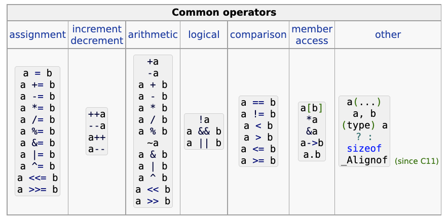

- ## Function
- ### Function Declarations
- Function 宣告可以讓 compiler 知道 `function name` 以及如何呼叫該 `function`。實際的函式定義如下
	- ```C
	  return_type function_name ( parameter list );
	  ```
- 在函式宣告中，型態為必須被指定，但變數名稱則可以省略。
	- ```C
	  void func1 (int num1, int num2);
	  int max(int, int);
	  int* findMaxIndex (int a[10]);
	  ```
- ### Calling a Function
-
- ### Function Arguments
- call by value
- call by reference
- ## Bitwise Operation
- ## String
	- [Strings library - cppreference.com](https://en.cppreference.com/w/c/string)
- ## Array
- ## Pointer
- ### Function Pointer
- ## struct  / union / enum
- ## Dynamic Memory Management
	- [Dynamic memory management - cppreference.com](https://en.cppreference.com/w/c/memory)
- ## storage-class specifiers
	- [Storage-class specifiers - cppreference.com](https://en.cppreference.com/w/c/language/storage_duration)
- ## writing OOP in C
	- struct
	- function pointer
- {:height 270, :width 539}
- ## Writing Call Back Function in C