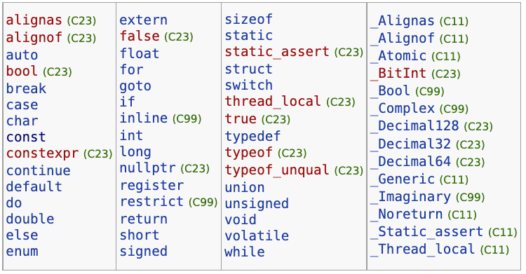
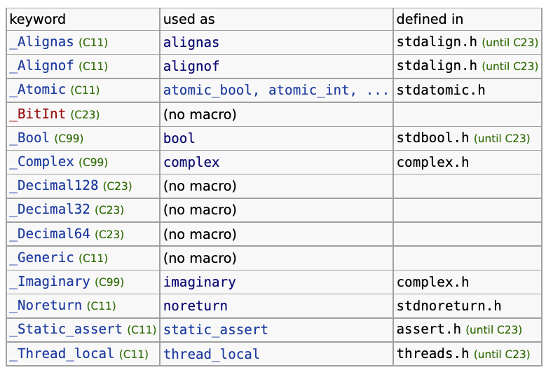

- [C reference - cppreference.com](https://en.cppreference.com/w/c)
- ## Basic Concepts
- ### Keywords
	- [C keywords - cppreference.com](https://en.cppreference.com/w/c/keyword)
	- 不可重新被定義
		- 
	- `_`：一個底線 (underscore) 開頭的 keyword 通常會使用他們定義的巨集
		- 
	-
- ### Identifiers
	- Objects
	- Functions
	- Struct
	- Union
	- Enumeration