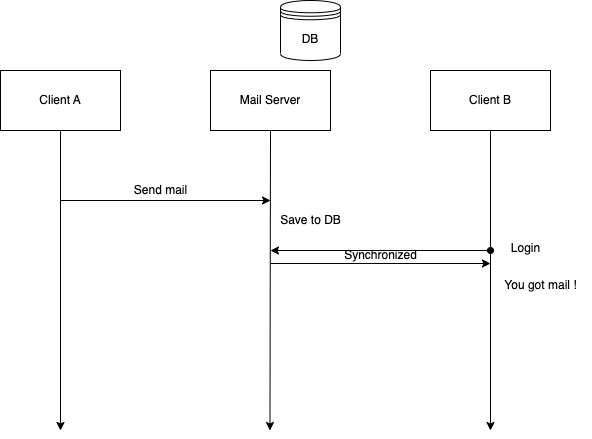

title:: Exam 1: Mail Server

- 信件收發系統包含收發的伺服器與對應的客戶端。當今天 *客戶 A* 要傳電子郵件給 *客戶 B* 時，會透過伺服器將郵件先行儲存，等到下次 *客戶 B* 連上伺服器後進行同步。我們可以在下面的架構圖中，檢視這個架構的組成。
	- {:height 544, :width 725}
- Client A 登入後，指定收件者為 Client B 後發送郵件。伺服器端接收到 Client A 收到的信件後，會先將郵件儲存在該伺服器的 database 之中，等到下次 Client B 登入再與其進行同步更新。
-
-
- 進階功能：
- 1. 修改程式讓伺服器同時服務多個 clients