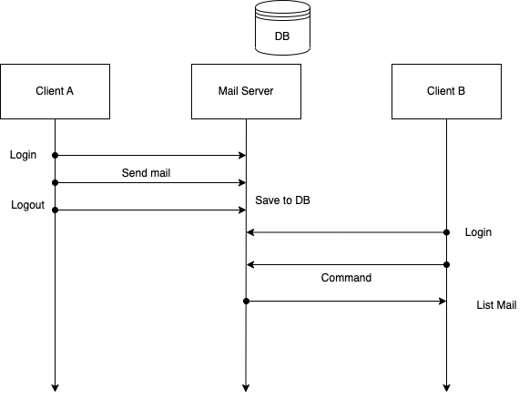

title:: Exam 1: Mail Server

- 信件收發系統包含收發的伺服器與對應的客戶端。當今天 *客戶 A* 要傳電子郵件給 *客戶 B* 時，會透過伺服器將郵件先行儲存，並更新 *客戶 B* 狀態。我們可以在下面的架構圖中，檢視這個架構的組成。
	- 
- Client A 登入後，指定收件者為 Client B 後發送郵件。伺服器端接收到 Client A 收到的信件後，會先將郵件儲存在該伺服器的 database 之中，同時更新 Client B 於資料庫中的資料。
-
- ## 檔案結構
	- ```
	  MailServerExam
	    |__ Documentations
	    |
	    |__ MailServer
	    |	  	|__ Data
	    |	  	|__ Bin
	    |	  	|__ Src
	    |	  	|__ Log
	    |
	    |__ Client
	    |     |__ Data
	    |     |__ Bin
	    |     |__ Src
	    |		|__ Log
	    |
	    |__ Readme.txt
	  ```
-
- ## 執行方式
- ### Server
- 進入 `Server/` 資料中，執行 `Bin/` 底下的 `run.py`
- ```bash
  cd Server
  python3 Bin/run.py
  ```
- ### client
- 進入 `Client/` 資料中，執行 `Bin/` 底下的 `run.py`
- ```bash
  cd Client
  python3 Bin/run.py
  ```
-
- ## 流程示意圖
	- 1. 開啟 server
		- ```
		  Popo-MacBook-Pro:SimpleMailService popo$ cd Server
		  Popo-MacBook-Pro:Server popo$ python3 Bin/run.py 
		  Socket successfully created
		  socket bind to 9999
		  ```
	- 2. Server 等待連線
		- ```bash
		  Popo-MacBook-Pro:Server popo$ python3 Bin/run.py 
		  Socket successfully created  
		  socket bind to 9999  
		  Wait for new connection.
		  ```
	- 3. 開啟 Client
		- ```bash
		  Popo-MacBook-Pro:SimpleMailService popo$ cd Client
		  Popo-MacBook-Pro:Client popo$ python3 Bin/run.py 
		  ```
	- 4. Client 端顯示輸入使用者姓名
		- ```
		  Please enter your name:
		  ```
	- 5. 輸入姓名後立即登入（無需密碼）
		- ```bash
		  ==========
		  Function list:
		  1. send mail
		  2. list inbox
		  3. Logout
		  Please enter mode:
		  ```
	- 6. 輸入模式 (1-3)
	- 7. 進入模式服務
- ### 功能介紹
- ### Login 介面
	- 定義兩個類別，分別是 `LoginService` 和 `LogoutService`。用於處理登入與登出功能。
	- 當 `Login` 時，若發現該使用者尚未註冊，會先要求註冊新的使用者。
- ### 傳送郵件
	- 選擇郵件傳送模式後，會依序填入 `recipient` 收件者的名字、`title` 郵件名稱、`content` 郵件內容。結束後信件即寄出
	- ```
	  ====================
	  Function list:
	  1. send mail
	  2. list inbox
	  3. Logout
	  
	  Please enter mode: 
	  1
	  
	  Enter recipient name: 
	  popo
	  
	  Enter mail title: 
	  123trest
	  
	  Enter content: 
	  Today is a nice day.
	  ```
- ### 顯示郵件
	- 選擇顯示郵件功能後，系統會將所有收到的郵件列出。
	- ```
	  {'from': 'popo', 'to': 'p', 'timestamp': '1665154064.2740211', 'title': 'iii', 'content': 'adfjadifj'}
	  {'from': 'p', 'to': 'p', 'timestamp': '1665154275.251765', 'title': 'aodfj', 'content': 'paodjoj poajdf'}
	  {'from': 'popo', 'to': 'p', 'timestamp': '1665192045.509682', 'title': '123', 'content': 'adfij iajdfie ej'}
	  ```
-
- ## 測試
- ### test case 1: 系統運作
  1. 登入 `user1`
  2. 測試寄信給 `user2`
  3. 登出 `user1`
  4. 登入 `user2`
  5. 顯示所有信件
  確認是否收到 user1 的信件
-
- ### test case 2: 重複使用者註冊
- 1. 輸入一個尚未註冊的使用者名稱
  2. 註冊一組
-
- ## 進階功能：
- 1. **easy** 修改程式讓伺服器可以註冊新的用戶 
  2. **medium** 將 Client 收到的信件儲存於本地端 
  3. **hard** 修改程式讓伺服器同時服務多個 clients
-