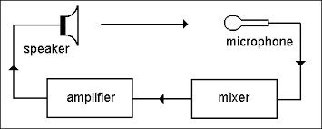

public:: true
title:: Lecture 01: Basic Concept

- ## 課程大綱
	- 連結
		- https://www.notion.so/ginedoc/ff671e5008aa4a6e82e676abe619f0f7?v=5287929ff6f94f5fa1252a6bd476206d
	- {:height 624, :width 735}
- ## 課堂前測
	- 連結：[W1-1 基本前測 (google.com)](https://docs.google.com/forms/d/e/1FAIpQLSdjyWf-qkU_Sd-bhIUxQYnKFoTof4sZ_8j0y9Jbt7yQVSHdYg/viewform)
- ## 快速複習 C/Python 概念
	- 如何閱讀文件？
	- 如何透過文件查找資訊？
	- C
		- [C Tutorial (tutorialspoint.com)](https://www.tutorialspoint.com/cprogramming/index.htm)
		- [cppreference.com](https://en.cppreference.com/w/)
		- [C documentation — DevDocs](https://devdocs.io/c/)
		- Practice: [Union](https://devdocs.io/c/keyword/union)
	- Python
		- [3.10.7 Documentation (python.org)](https://docs.python.org/3/)
			- 1. 以 Lambda function 為例：[4. More Control Flow Tools — Python 3.10.7 documentation](https://docs.python.org/3/tutorial/controlflow.html#lambda-expressions)
			- 2. 以 Logging 為例：[Logging HOWTO — Python 3.10.7 documentation](https://docs.python.org/3/howto/logging.html)
		- Practice: FILE IO
- ## 電腦架構
	- CPU - Memory - IO
		- CPU 中央處理器，Central Processing Unit
			- Control Unit 控制單元
			- Arithmetic & Logic Unit 邏輯與運算單元
			- Registers 暫存器
		- Memory 記憶體
			- Main Memory : Random Access Memory
			- Auxiliary Storage : Hard Disk, SSD
		- IO
	- 示意圖
		- 
		  id:: 632dc308-d8cc-483e-9535-90edc718fc9d
- ## 系統架構
	- 什麼是系統？
		- 
	- 依照系統的特性分類
		- 連續時間 (continuous time) / 離散時間 (discrete time)
		- 無記憶 (memoryless) / 有記憶 (memory)
		- 有因果 (casual) 系統 / 非因果 (noncasual) 系統
		- 線性 (linear) 系統 / 非線性 (nonlinear) 系統
		- 時變 (time-varying) 系統 / 非時變 (time-invariant) 系統
	- 設計一個穩定的系統
		- 一個穩定的系統具備 **有界的輸入** 與 **有界的輸出**
			- 穩定的系統：Parking Lot System, Bank Account Management System
				- 
			- 不穩定的系統：麥克風收音回授 (Feedback), DDoS
				- |   | |
				  |---|---|
				  | microphone feedback | DDoS |
	- 課堂練習
		- 台南市政府想要在火車站前興建一個全自動停車場，該停車場毋須人工即可完成營運。請你依照市政府的需求，列舉
		  1. 基本所需的功能 (如：車牌辨識系統)
		  2. 各個功能的邊界條件為何 (如：車牌號碼的長度限制)
		  3. 功能間如何運作
- ## 回家作業
	- 請用 python 實作一個簡單的計算機，此計算機包含與使用者互動之介面即基本加減乘除、方根次方等功能。
		- 進階：牛頓法堪根功能
-
- ## 補充資料
	- {{video https://www.youtube.com/watch?v=SzJ46YA_RaA}}
-
-
- 下一章節：[[Lecture 02: Version Control using Git]]
-