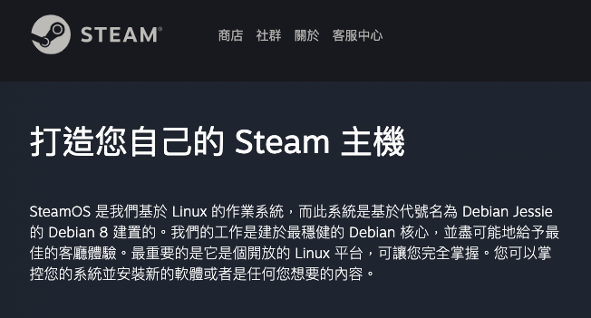

title:: Lecture 03: Linux and Basic Manipulation

- title:: Lecture 03: Linux and Basic Manipulation
  public:: true
- {:height 221, :width 236}
- ## Linux 是什麼？
	- ### 你怎麼可以不知道 Linux ?!
		- NASA
			- 
		- Google / Android
			- 
		- Steam
			- 
		- 台灣政客
			- | {:height 129, :width 513} | {:height 105, :width 168} |
	- ### 系統架構
		- 
	- ### 常見的發行版本
		- | **版本** | **Logo** |
		  | --- | --- |
		  | Ubuntu | {:height 153, :width 454} |
		  | Debian | {:height 276, :width 223} |
		  | Fedora | {:height 145, :width 455} |
		  | Arch Linux | {:height 200, :width 465} |
		-
		- 發行版列表：[DistroWatch.com: Put the fun back into computing. Use Linux, BSD.](https://distrowatch.com/dwres.php?resource=popularity)
		-
- ## 檔案系統
	- ### 概述
		- 
		- 檔案系統是種邏輯概念，抽象個是實體儲存裝置。
			- 實體儲存裝置：硬碟、網路儲存、主記憶體等等
			- 邏輯概念：檔案、目錄、路徑、檔案屬性
		- Virtual file system, VFS
			- 檔案操作的抽象介面，照著 VFS 介面開發的檔案系統，可以在執行時期掛載到 Linux 核心
		- Filesystem in Userspace (FUSE)
			- 在 Userspace 中延伸檔案系統
			- 透過 FUSE 掛載 Google Drive 的內容，讓遠端物件對應到本地端的檔案系統之中
	- ### Virtual File System, VFS
		- 
	- ### Filesystem Hierarchy Standard, FHS
		- {:height 415, :width 747}
		- | Directory | Description |
		  | / | 整個檔案系統的根路徑 (Root Directory) |
		  | /bin | 基本指令的 binaries 檔案存放位置， *e.g.*, cat, ls, cp. |
		  | /etc | 系統檔案設定。在原先 Bell 實驗室的設計是放置不屬於任何類別的文件，etc 代表的是 etcetera directory。但今天我們多將其視作 "Editable Text Configuration" 或者是 "Extended Tool Chest" 的簡寫。 |
		  | /sbin | 必要的系統指令 binaries 檔案， *e.g.*, fsck, init, route. |
		  | /usr | *Secondary hierarchy* for read-only user data; contains the majority of (multi-)user utilities and applications. |
		  | /var | Variable files—files whose content is expected to continually change during normal operation of the system—such as logs, spool files, and temporary e-mail files. |
		-
- ## 基本操作指令
	- `pwd`: path of the current working directory
	- `cd`: change directory
		- `cd ..`: 向上移動一個位置
		- `cd`: 回到 `home` 資料夾
		- `cd -`: 回到上一個位置
	- `ls`: list computer files and directories
		- `ls -R`: 同時列出子目錄的檔案
		- `ls -a`: 同時顯示隱藏的檔案
		- `ls -al`: 列出檔案與目錄，與其相關的資訊，諸如權限、大小、使用者等等
	- `cat`: concatenate，將檔案於標準輸出 (stdout) 中輸出
		- `cat file.txt`: 將 `file.txt` 的內容輸出於標準輸出中
		- `cat > filename`: 建立一個新的檔案
		- `cat filename1 filename2 > filename3`: 將 `filename1` 與 `filename2` 合併，並將其處存在新的檔案 `filename3` 之中
	- `cp`: copy
		- `cp image.jpg` `/home/username/Pictures`: 將 `image.jpg` 複製一份至 `/home/username/Pictures` 的路徑之下
	- `mv`: move ，移動檔案至某個路徑底下
	- `mkdir`: 建立路徑
		- `mkdir -p`: 建立兩個已建立資料夾中的路徑
	- `rmdir`: 移除路徑，僅限空的路徑位置
	- `rm`: remove
		- `rm -r`
	- `touch`: 建立新的空白檔案
		- `touch /home/user/Documents/Web.html`
	- `find`: 檔案/路徑搜尋
		- `find [directory] -name [filename]`
	- `grep`
		- `grep [keyword] [filename]`
	- `sudo`: SuperUser Do
	- `chmod`: change mode (read/write/execute permission)
	- `top`: 工作管理員
	- `man`: manual
- ## 安裝 WSL：在 Windows 上模擬 Linux 環境
	- [使用 WSL 執行 2021 乙組考試範例 - HackMD](https://hackmd.io/rsZk_L5IQ7OWbi-j8aCp2w)
	-
- ## 實際操作
	- ### 檔案操作
		- 1. 請在 `home/Documents` 目錄下建立一個 新的資料夾，該資料夾名稱為 `Test`
		  2. 請在該 `Test` 資料夾底下建立兩個新的檔案，檔案名稱為 `test1.txt`, `test2.txt`
		  3. 將 "This is the first file" 寫入 `test1.txt`
		  4. 將 "This is the second file" 寫入 `test2.txt`
		  5. 將 `test1.txt` 與 `text2.txt` 的文字合併，並將其寫入 `test3.txt`
		  6. 在標準輸出上顯示 `test3.txt` 之內容
		  7. 列出 `home/Documents` 資料夾中的所有檔案，確認無誤
		  8. 刪除 `home/Documents` 底下之 `Test` 資料夾
	- ### 複製遠端專案：git clone
		- ```bash
		  $ git clone [repository url]
		  ```
	- ### 編譯C, C++程式：gcc
		- ```bash
		  $ gcc -o test_c test.c
		  $ g++ -o test_cpp test.cpp
		  $ ./test_c
		  $ ./test_cpp
		  ```
	- ### 編寫與執行 Python
		- ```bash
		  $ python3 test_python.py
		  ```
- ## 回家作業
	- [[Project 1: 1A2B]]
-
- 上一章節：[[Lecture 02: Version Control using Git]]
- 下一章節：[[Lecture 04: Network Programming]]
-