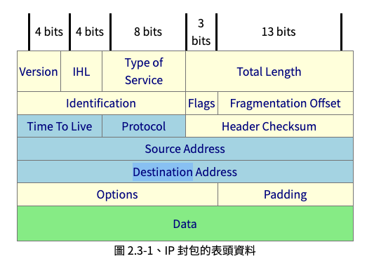
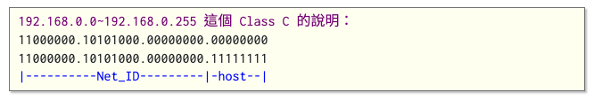
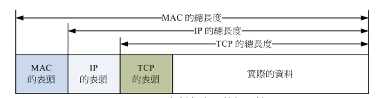
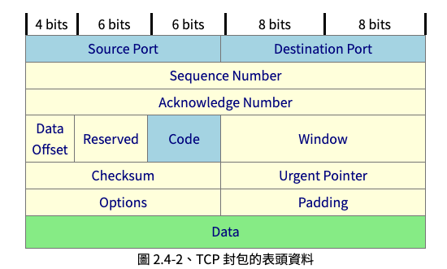
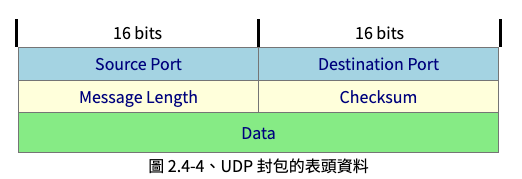

title:: Lecture 04: Network Programming

- public:: true
  title:: Lecture 04: Network Programming
- ## What is Internet？
	- ### 網路的組成元件
		- Node : 具有網路位置 (IP) 的設備
		- Server : 提供資料回應用戶主機的機器
		- Workstation / Client : 發起連線請求的機器
		- Network Interface Card, NIC : 網路卡
		- Network Interface : 以軟體設計的網路介面，主要提供網路位置 (IP) 的服務。
		- Topology : 網路型態、網路拓墣。即網路上節點間連結的方式。
		- Route / Gateway :  具有兩個以上的網路介面，使其可以連接兩個以上不同網段的設備。
			- e.g. router
		- https://linux.vbird.org/linux_server/centos6/0110network_basic//components.png
	- ### 網路的區域範圍
		- Local Area Network, LAN
		- Wide Area Network, WAN
		- old
		  | | LAN | WAN |
		  | 範圍 | 較小 | 較大 |
		  | 速度 | 較快 | 較慢 |
		  | 品質 | 較穩定 | 可靠性較低 |
		  | 場域 | 校園、大樓 | 城市 |
		  | 應用 | 分散式系統、雲端負荷分擔系統 | FTP, WWW |
		- 若從速度來看。TANET 臺灣學術網路，亦可視作是一個區域網路！ (100Mbps)
	- ### 網路通訊協定 : [[OSI]] 七層協定
		- | https://linux.vbird.org/linux_server/centos6/0110network_basic//osi_layer_to_layer.gif | https://linux.vbird.org/linux_server/centos6/0110network_basic//osi_packet.gif |
		- | 分層 | 負責內容 |
		  | Layer 1  實體層 <br><br/> **Physical Layer** | 由於網路媒體只能傳送 0 與 1 這種位元串，因此實體層必須定義所使用的媒體設備之電壓與訊號等， 同時還必須瞭解資料訊框轉成位元串的編碼方式，最後連接實體媒體並傳送/接收位元串。 |
		  | Layer 2  資料鏈結層 <br><br/> **Data-Link Layer** | 這一層是比較特殊的一個階層，因為底下是實體的定義，而上層則是軟體封裝的定義。因此第二層又分兩個子層在進行資料的轉換動作。 在偏硬體媒體部分，主要負責的是 MAC (Media Access Control) ，我們稱這個資料包裹為 MAC 訊框 (frame)， MAC 是網路媒體所能處理的主要資料包裹，這也是最終被實體層編碼成位元串的資料。MAC 必須要經由通訊協定來取得媒體的使用權， 目前最常使用的則是 IEEE 802.3 的乙太網路協定。詳細的 MAC 與乙太網路請參考下節說明。 <br><br/> 至於偏向軟體的部分則是由邏輯連結層 (logical link control, LLC) 所控制，主要在多工處理來自上層的封包資料 (packet) 並轉成 MAC 的格式， 負責的工作包括訊息交換、流量控制、失誤問題的處理等等。 |
		  | Layer 3  網路層 <br><br/> **Network Layer** | 這一層是我們最感興趣的囉，因為我們提及的 IP (Internet Protocol) 就是在這一層定義的。 同時也定義出電腦之間的連線建立、終止與維持等，資料封包的傳輸路徑選擇等等，因此這個層級當中最重要的除了 IP 之外，就是封包能否到達目的地的路由 (route) 概念了！ |
		  | Layer 4  傳送層 <br><br/> **Transport Layer** | 這一個分層定義了發送端與接收端的連線技術(如 TCP, UDP 技術)， 同時包括該技術的封包格式，資料封包的傳送、流程的控制、傳輸過程的偵測檢查與復原重新傳送等等， 以確保各個資料封包可以正確無誤的到達目的端。 |
		  | Layer 5  會談層 <br><br/> **Session Layer** | 在這個層級當中主要定義了兩個位址之間的連線通道之連接與掛斷，此外，亦可建立應用程式之對談、 提供其他加強型服務如網路管理、簽到簽退、對談之控制等等。如果說傳送層是在判斷資料封包是否可以正確的到達目標， 那麼會談層則是在確定網路服務建立連線的確認。 |
		  | Layer 6  表現層 <br><br/> **Presentation Layer** | 我們在應用程式上面所製作出來的資料格式不一定符合網路傳輸的標準編碼格式的！ 所以，在這個層級當中，主要的動作就是：將來自本地端應用程式的資料格式轉換(或者是重新編碼)成為網路的標準格式， 然後再交給底下傳送層等的協定來進行處理。所以，在這個層級上面主要定義的是網路服務(或程式)之間的資料格式的轉換， 包括資料的加解密也是在這個分層上面處理。 |
		  | Layer 7  應用層 <br><br/> **Application Layer** | 應用層本身並不屬於應用程式所有，而是在定義應用程式如何進入此層的溝通介面，以將資料接收或傳送給應用程式，最終展示給使用者。 |
- ## TCP/IP
	- ### IP 封包與封裝
		- IP = Internet Protocol
			- IPv4 : 32 bits
			- IPv6 : 128 bits
		- IP 封包的標頭資料
		  collapsed:: true
			- 
	- ### IP 位置
		- IPv4 : 32 bits
			- 00000000.00000000.00000000.00000000(2) = 0.0.0.0 (10)
			- 11111111.11111111.11111111.11111111(2) = 255.255.255.255 (10)
		- 
			- 同一物理網段內，主機的 IP 具有相同的 Net ID，但有獨立的 Host ID
	- ### IP 位置的種類
	  collapsed:: true
		- Public IP
		- Private IP
			- Class A: 10.0.0.0 - 10.255.255.255
			- Class B: 172.16.0.0 - 172.31.255.255
			- Class C : 192.168.0.0 - 192.169.255.255
	- ### [[TCP]]/IP 傳輸層封包與資料
		- 於 [[OSI]] 架構定義的傳輸層 [[Transport Layer]] 中進行傳輸
		- 
		- TCP 的標頭資料
		  collapsed:: true
			- 
			- `Source Port` &&  `Destination Port` (來源與目標[[埠口]] ([[Port]]))
				- 透過 IP 位置我們可以得知資料的傳輸終點，但兩相是如何連通的，就會需要透過 [[Port]] 來連接。
				  
				  我們可以將 IP 看作是國家，而 Port 則對應的是港口或是機場。好比說船隻駛到台灣後，需要經過港口 (e.g. 花蓮港) ，裡面的物品才能上岸一般
			- `Sequence Number` (封包序號)
				- 當今天要傳送的封包過大，無法一次進行傳輸時，就要分段傳輸。透過 `Sequence Number` 讓收受端可以重新將資料組合
			- `Acknowledge Number` (回應序號)
			- `Data Offset`
			- `Reserved`
			- `Code (Control Flag)` (控制標誌碼)
				- 6 bits (000000)
					- URG (Urgent)
						- 緊急封包，使用此標誌同時 Urgent Pointer 也會被使用
					- ACK (Acknowledge)
						- 回應封包
					- PSH (Push function)
						- 立即傳送緩衝區內的對應封包，無需等待緩衝區填滿
					- RST (Reset)
						- 立即中止連線，是一個前強制斷開連線的標誌
					- SYN (Synchronous)
						- 詢問對方是否同意建立連線
					- FIN (Finish)
						- 傳送結束，發送者等待對方回應是否同意斷線
			- `Window` 滑動視窗
				- 收受者告知當前 Receive Buffer 尚可接收封包的空間。若緩衝區已滿，應該要暫停資料傳輸。
				- 透過 `Window` 來控制封包流量
			- `Checksum`
				- 透過 [[Checksum]] 用來確認資料的正確性
			- `Urgent Pointer`
				- 當 `Code` 的 `URG` 為 1 時才會作用，可以告知緊急資料所在的位置
			- `Options`
			- `Padding`
			-
			-
			-
				-
		- 通訊埠口 [[Port]]
		  collapsed:: true
			- $$2^{16} = 65535$$
			- 特殊埠口 [[Privileged Port]]
				- | Port | Content |
				  | --- | --- |
				  | 20 | FTP-data |
				  | 21 | FTP |
				  | 22 | SSH |
				  | 23 | Telnet |
				  | 25 | SMTP |
				  | 53 | DNS |
				  | 80 | WWW |
				  | 110 | POP3 |
				  |443 | https |
				  | < 1024 | needed to be root to use |
		- Socket Pair
		  collapsed:: true
			- Source Address + Source Port
			- Destination Address + Destination Port
	- ### TCP 的三項握手
	  collapsed:: true
		- {:height 407, :width 326}
		- {:height 489, :width 675}
- ## UDP
	- UDP 的標頭資料
		- 
	- 非連接導向的協定
	- UDP = User Datagram Protocol (用戶資料流協定)
	- 毋須 ACK
	- 與 TCP 的比較
		- | Item | TCP | UDP |
		  | --- | --- | --- |
		  | 速度 | 較慢 | 較快 |
		  | 穩定性 | 較高 | 交低 |
		  | 資料傳輸量 | 較小 | 較大 | 
		  | 應用 | 瀏覽網頁 | 網路攝影機、串流 |
- ## Socket Programming
	- TCP Socket Flow
	  collapsed:: true
		- {:height 916, :width 626}
	- Server
		- ```python
		  # echo-server.py
		  
		  import socket
		  
		  HOST = "127.0.0.1"  # Standard loopback interface address (localhost)
		  PORT = 65432  # Port to listen on (non-privileged ports are > 1023)
		  
		  
		  ### AF_INET : IPv4
		  ### SOCK_STREAM : TCP
		  with socket.socket(socket.AF_INET, socket.SOCK_STREAM) as s:
		    s.bind((HOST, PORT))
		    s.listen()
		    conn, addr = s.accept()
		    with conn:
		        print(f"Connected by {addr}")
		        while True:
		            data = conn.recv(1024)
		            if not data:
		                break
		            conn.sendall(data)
		  ```
	- Client
		- ```python
		  # echo-client.py
		  
		  import socket
		  
		  HOST = "127.0.0.1"  # The server's hostname or IP address
		  PORT = 65432  # The port used by the server
		  
		  with socket.socket(socket.AF_INET, socket.SOCK_STREAM) as s:
		    s.connect((HOST, PORT))
		    s.sendall(b"Hello, world")
		    data = s.recv(1024)
		  
		  print(f"Received {data!r}")
		  ```
- ## It's Your Turn!
  collapsed:: true
	- 將範例 code 改寫
		- TODO  進行五次收送後關閉伺服器
		- TODO 改成 UDP 傳送，看看傳送 100, 1000... 次時封包遺失的比例
		- TODO 在不同電腦間進行傳輸
		- TODO 改寫 1A2B 題目 [[Project 2: 1A2B (TCP version)]]
	-
- ## References
  collapsed:: true
	- 1. [鳥哥私房菜 - 第二章、基礎網路概念 (vbird.org)](https://linux.vbird.org/linux_server/centos6/0110network_basic.php#ps6)
	- 2. [Socket Programming HOWTO — Python 3.10.7 documentation](https://docs.python.org/3/howto/sockets.html)
	- 3. [Socket Programming in Python (Guide) – Real Python](https://realpython.com/python-sockets/)
-
- 上一章節 : [[Lecture 03: Linux and Basic Manipulation]]
- 下一章節 : [[Lecture 05: Basic Compiling Process]]
-