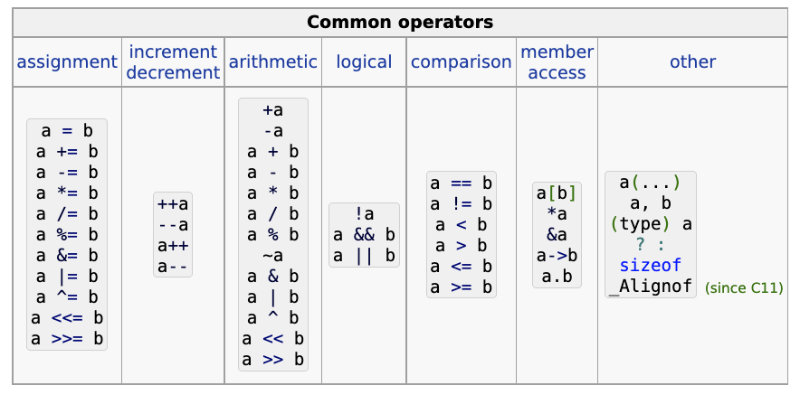

- ## Dynamic Memory Management
	- [Dynamic memory management - cppreference.com](https://en.cppreference.com/w/c/memory)
	- malloc
		- 動態配置記憶體
		- ```C
		  // defined in header <stdlib.h>
		  void *malloc (size_t size);
		  ```
		- 透過 `malloc` 配置的記憶體空間並不會被初始化。
		- 如果透過 `malloc` 配置成功，則該函式會回傳該空間的起始位置。此 `void *` 的指標可以指向任何具有基本 alignment 的`object` 型態。
		- 如果 `size` 為 $0$ 的話，回傳的行為則是 **implementation-defined**。何謂 implementation-defined？即是由 compiler 的實作決定。
			- 一般來說，`malloc(0)`的回傳值會是 ((6361cf31-9ca3-4f21-a5de-62d5674df65b))。
			- 不過也是有可能為非 null pointer 的值，儘管如此，回傳的 pointer 不能被 [[dereferenced]]，而且應該要被 ((63620953-55d8-4e39-8dbd-43e15c5869b0))，以避免 [[memory leak]] 。
	- calloc
		- 配置數量為 `num` 個，大小為 `size` 的記憶體空間，。
	- realloc
	- free
	  id:: 63620953-55d8-4e39-8dbd-43e15c5869b0
- ### Stack overflow / Heap overflow
-
- ## String
	- [Strings library - cppreference.com](https://en.cppreference.com/w/c/string)
## struct  / union / enum
- ## Bitwise operator
## storage-class specifiers
	- [Storage-class specifiers - cppreference.com](https://en.cppreference.com/w/c/language/storage_duration)
	- static, automatic, and allocated.
## writing OOP in C
	- struct
	- function pointer
- {:height 270, :width 539}
## Writing Call Back Function in C